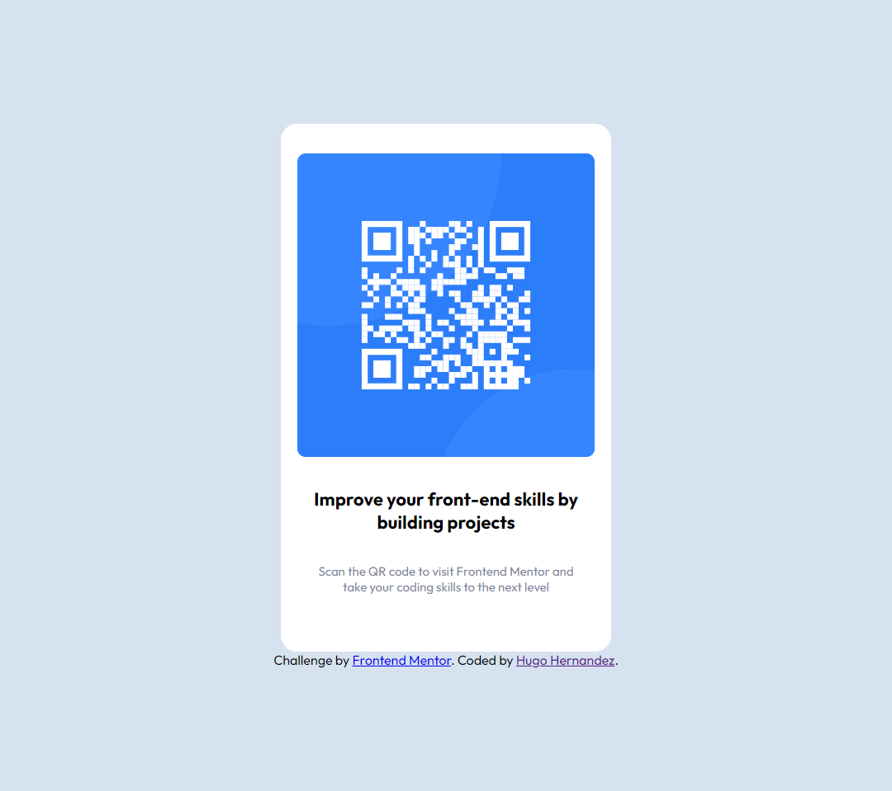

# Frontend Mentor - QR code component solution

This is a solution to the [QR code component challenge on Frontend Mentor](https://www.frontendmentor.io/challenges/qr-code-component-iux_sIO_H). Frontend Mentor challenges help you improve your coding skills by building realistic projects.

### Screenshot

### Links

-Solution Url: "https://github.com/HugoHern/frontend-mentor-qrcode"
-Live Site Url: "hugohern.github.io"

### Process

Built with vanilla html and Css.

### What I learned

I learned a lot about paying attention to small details.
